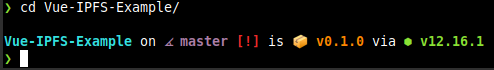

# Melroy's GNU/Linux setup

Hi! My GNU/Linux dotfiles, a collection of Unix configuration files. See [Melroy's home](home/melroy) folder.

**Currently Running:** [Linux Mint XFCE](https://www.linuxmint.com/edition.php?id=278) (I used to use: [Manjaro](https://manjaro.org/get-manjaro/), and many many other distros I tried in the past).

Besides my personal dot files (in [home](home/melroy)), you'll find some configuration files from [/etc](etc) folder as bonus material!

## Shells

### Starship

Install Starship, awesome prompt for any shell:

`curl -fsSL https://starship.rs/install.sh | bash`



### Fish Shell

Install [Fish shell](https://fishshell.com/). See functions in `/home/melroy/.config/fish/functions`.

**Status:** Using Bash with Starship.

## Hardware setup

Current hardware setup (planned to upgrade *all components* except GPU):

* CPU: Intel Core i7 920 
* Motherboard: Asus Rampage II Extreme
* Memory: Corsair XMS Dominator 6GB DDR3 triple kit 
* Videocard: AMD Radeon RX 580
* Storage: Corsair F120 Force Series SSD 120GB
* Monitors: Samsung SyncMaster 2494HM & AOC G2590PX (FreeSync 144Hz)

## Games

Native games:

* 0ad

A lot of games I play via Wine (`wine` = Wine Is *NOT* an Emulator) under GNU/Linux or Proton via Steam.

## Manjaro

### Packages

Extra installed packages:

```sh
# pacman -S nfs-utils telegram-desktop etcher compton conky conky-manager celestia darktable deepin-calculator deepin-calendar deepin-voice-recorder filezilla transmission-gtk dnsutils retroarch retroarch-assets-xmb libretro-snes9x libretro-shaders-cg libretro-reicast libretro-ppsspp libretro-overlays libretro-mupen64plus libretro-gambatte libretro-core-info nginx mariadb php php-fpm php-gd php-intl wine-staging-nine wine-tricks furiousisomount
```

Extra installed AUR packages (Enable AUR within the pamac Settings window):

`# pamac install atom-editor-bin green-recorder emulationstation emulationstation-autoscraper`

Try:

`simplescreenrecorder`

`discord` (PTB) via deb

`peek`

Install vulkan support: `# pacman -S vulkan-tools`

## Wine

Start clean:

`rm -rf ~/.wine`

During first start, use the following command to create a 32-bit wine bottle:
`WINEARCH=win32 wine wineboot`

Install via winetricks, for the current wine prefix:
@fonts:
* corefonts

@Windows DLL/Components:
* d3dx9 (for DirectX9 support)
* dxvk (for Vulkan support)
* optionally: mfc42
* optionally: vcrun2xxx (eg. 2013 for the required DLLs)

## MySQL (MariaDB)

Before starting:

`mysql_install_db --user=mysql --basedir=/usr --datadir=/var/lib/mysql`

Set new root password, via:

`mysqladmin -u root password`

Finally:

```sh
systemctl start mariadb
systemctl enable mariadb
```

## Web-browser

Firefox! With additional extenstions installed:

* uBlock Origin
* LastPass
* IPFS Companion
* RESTClient

## Firewall rules (ufw)

Optionally configured firewall.

This is the graphical viewer (`gufw`):


