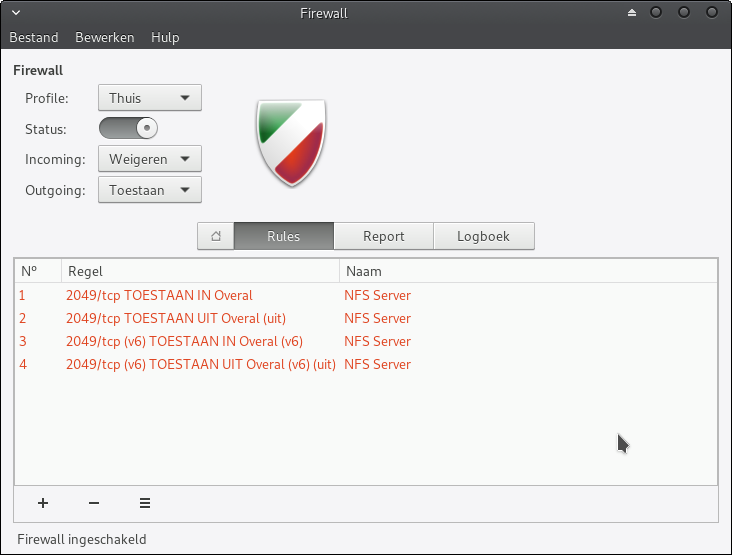

# Linux Mint

[Linux Mint](https://linuxmint.com/) is a community-driven Linux distribution based on Ubuntu.

I either use Linux Mint XFCE Edition or the Cinnamon Edition.

## PPA packages

```sh
# Nextcloud desktop
sudo add-apt-repository ppa:nextcloud-devs/client
# Inkscape
sudo add-apt-repository ppa:inkscape.dev/stable
# Shutter
sudo add-apt-repository ppa:shutter/ppa
# Kazam
sudo add-apt-repository ppa:sylvain-pineau/kazam
# 0Ad
sudo add-apt-repository ppa:wfg/0ad
# X2Go
sudo apt-add-repository ppa:x2go/stable
# Keepassxc
sudo add-apt-repository ppa:phoerious/keepassxc
# Papirus icons
sudo add-apt-repository ppa:papirus/papirus
# Nice collection of apps/games: https://xtradeb.net/category/play/
sudo add-apt-repository ppa:xtradeb/apps
# Wireshark
sudo add-apt-repository ppa:wireshark-dev/stable
# Git
sudo add-apt-repository ppa:git-core/ppa
# Ruby RVM
sudo add-apt-repository ppa:rael-gc/rvm
# PHP
sudo add-apt-repository ppa:ondrej/php

# Trigger update
sudo apt update
```

**Codium:**

```sh
wget -qO - https://gitlab.com/paulcarroty/vscodium-deb-rpm-repo/raw/master/pub.gpg \
    | gpg --dearmor \
    | sudo dd of=/usr/share/keyrings/vscodium-archive-keyring.gpg

echo 'deb [ signed-by=/usr/share/keyrings/vscodium-archive-keyring.gpg ] https://download.vscodium.com/debs vscodium main' \
    | sudo tee /etc/apt/sources.list.d/vscodium.list
```

**Floorp:**

```sh
curl -fsSL https://ppa.floorp.app/KEY.gpg | sudo gpg --dearmor -o /usr/share/keyrings/Floorp.gpg
sudo curl -sS --compressed -o /etc/apt/sources.list.d/Floorp.list "https://ppa.floorp.app/Floorp.list"
sudo apt update && sudo apt install floorp
```

## APT Packages

Software hat I install, which is not installed by default (be sure to add the PPAs above, if needed):

```sh
sudo apt install htop btop iotop iftop iperf3 git zsh gparted \
nvme-cli smartmontools  minicom neovim autokey-gtk \
mumble nemo-nextcloud gimp inkscape nvtop peek \
foliate codium nextcloud-desktop wireshark filezilla \
wine kazam nginx php8.4-cli php8.4-fpm dnsutils \
vulkan-tools ghex keepassxc kazam shutter
```

Native Linux games:

```sh
# Install 0ad
sudo apt install 0ad 0ad-data
```

## XFCE

In case of XFCE (_disclaimer:_ can break your system):

```sh
# Latest of the latest XFCE, thunar, catfish, tumbler from staging
sudo add-apt-repository ppa:xubuntu-dev/staging
```

## MySQL (MariaDB)

Before starting:

`mysql_install_db --user=mysql --basedir=/usr --datadir=/var/lib/mysql`

Set new root password, via:

`mysqladmin -u root password`

Finally:

```sh
systemctl start mariadb
systemctl enable mariadb
```

## Firewall rules (ufw)

Optionally configure firewall.

This is the graphical viewer (`gufw`):


